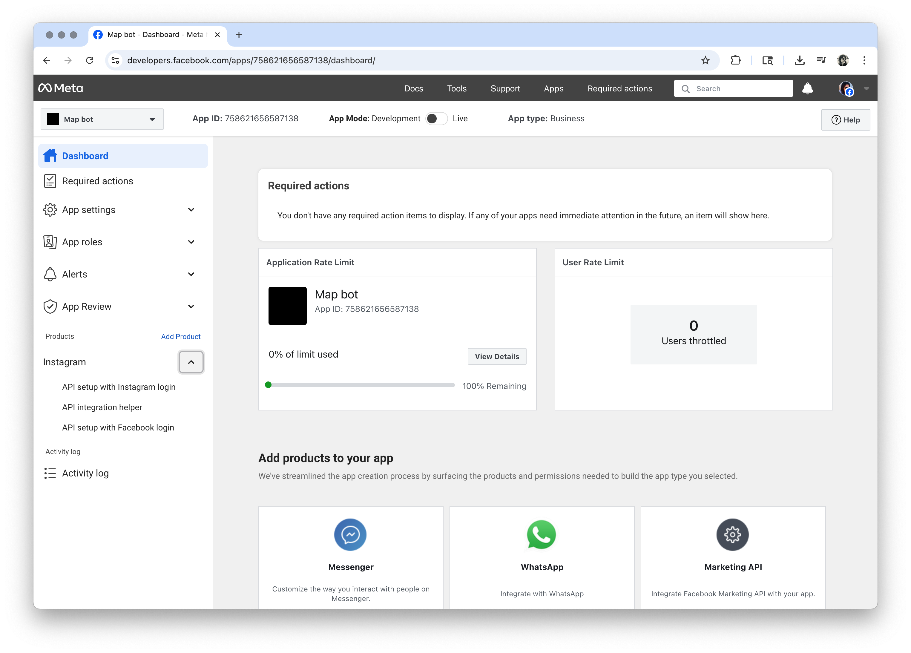

# 697 robotz
# july 2nd, 2025
# how to build a bot to automatically post good references for a map design

To build a bot to automatically post once a day on Instagram, adopting as source the Internet Archive API, using Python in a iMac, we need to:

1. Create a Meta developer environment and accounts needed, as well as set up other requirements;
2. Write a script to automate an Instagram post using Meta Graph API;
3. Write a script on a .plist file to set an automatic task trigger and save it in the LauchAgents folder to you Mac computer;
4. Write a script to download a set of images from a serch at Internet Archive using their API, in accordance with Instagram requirements;
5. Upload and publish the resulting images in a GitHub respository;
6. Uptade the first script (point 2) to get the actual images;
7. Repeat points 4 to 6 when new images were needed.

Further developments:
1. Formating and uploading proper captions;
2. Create a log text file to record the images posted and exclude then for the next posting process;
3. Refine the process of resizing or cropping;
4. Create a carossel post, with a crop of a detail as first image and the entery one as second;
5. Automate the process to upload the images to GitHub.

This is the result:
https://www.instagram.com/undr.constrctn/
Check it out tomorrow at 8am! 

For this tutorial, we'll focus on the points 1 to 3. 

1. Creating a Meta for Developers environment

You will need to have: 
1. Instagram business account;
2. Facebook account;
3. Facebook business page;
4. Meta profile to centralize the accounts

